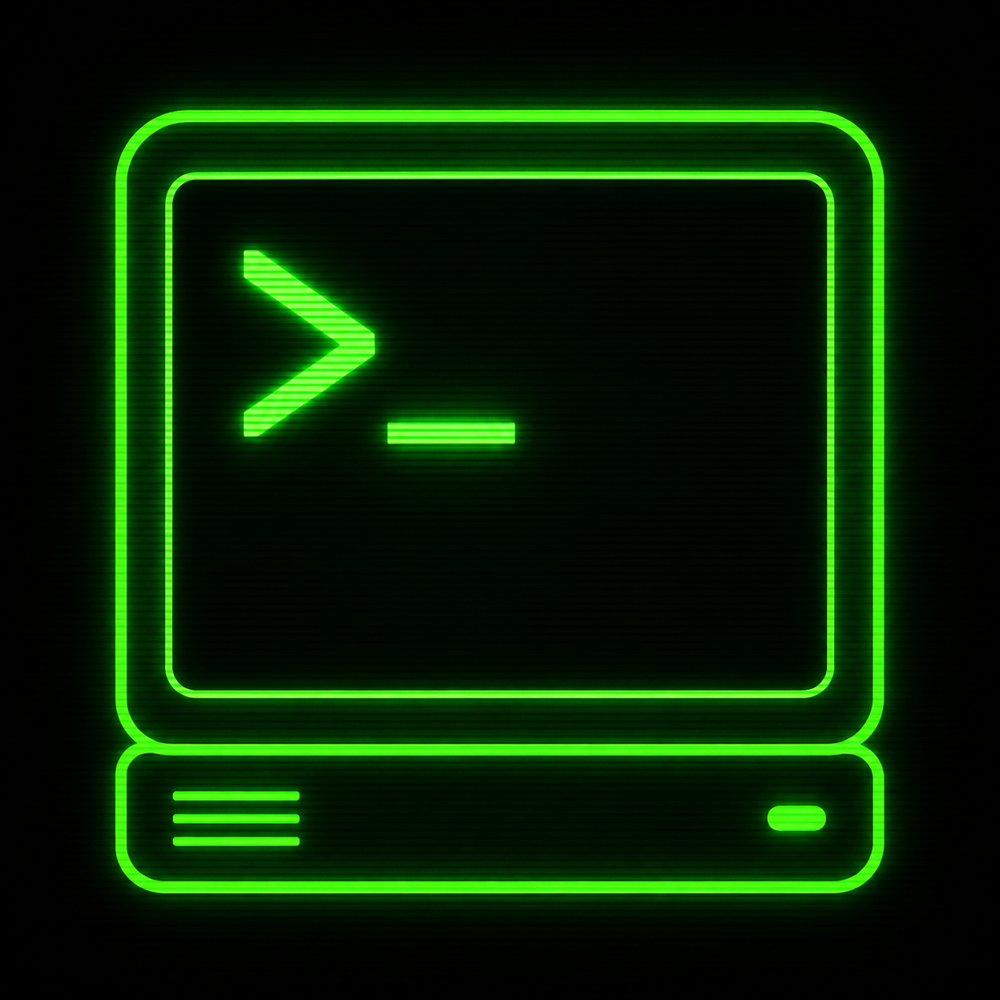
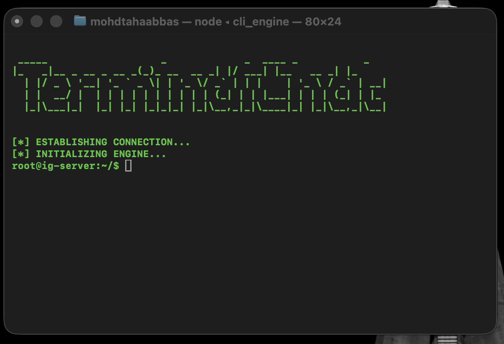

<div align="center">
  
  <h1>TerminalChat</h1>
  <p><strong>The Hacker Terminal for Instagram DMs. Combat Brainrot. Escape the Reels.</strong></p>

  <p>
    <a href="#features">Features</a> •
    <a href="#why-terminalchat">Why?</a> •
    <a href="#installation">Installation</a> •
    <a href="#usage">Usage</a>
  </p>
</div>

<br/>

<div align="center">
  
</div>

## 🧠 Why TerminalChat?

Instagram is designed to hijack your attention. You log in to reply to a single DM from a friend, and suddenly you're scrolling through 45 minutes of mindless Reels, brainrot, and algorithms designed to keep you trapped.

**TerminalChat** is the antidote. It strips away the UI, the addictive feeds, the explore page, and the infinite scrolling. It transforms your Instagram DMs into a pure, distraction-free, 1990s-style hacker terminal CLI. 

Read your messages. Reply to your friends. Get out. Stay focused.

## 🚀 Features

- **Matrix Aesthetics**: Immerse yourself in a beautifully styled, green-on-black terminal environment complete with blinking block cursors and typewriter text effects.
- **Zero Distractions**: No reels. No stories. No explore page. Just you and your chats.
- **Live Sync**: Uses an invisible headless browser (Playwright) to instantly route your messages in real-time.
- **Privacy First**: Everything runs entirely on your local machine. No middleman servers, no data scraping.
- **Mac Native**: Packaged as a lightweight, plug-and-play `.dmg` macOS application.

## 🛠 Installation

1. Go to the [Releases page](../../releases) and download the latest `TerminalChat.dmg`.
2. Open the `.dmg` file and drag **TerminalChat** into your Applications folder.
3. Launch the app! The terminal will automatically boot up, establish a secure connection, and guide you through a one-time login.

*(Note: On your first launch, macOS may warn you about an unrecognized developer. Go to System Settings -> Privacy & Security to allow it to run).*

### ⚠️ "Unidentified Developer" or "App is damaged" error
Because this app is an independent open-source project and not signed with a paid Apple Developer certificate, macOS Gatekeeper will block it on the first launch. 

To bypass this safely:
1. **Right-click** (or Control-click) the `TerminalChat` app in your Applications folder.
2. Select **Open** from the context menu.
3. Click **Open** again in the warning dialog box.

If it explicitly says the app is "damaged and should be moved to trash", macOS is being overly aggressive with its quarantine. You can instantly fix this by opening your Mac's Terminal and running:
```bash
xattr -cr /Applications/TerminalChat.app
```
Then launch the app normally!

### 🏗️ Build from Source (Bypass Gatekeeper Entirely)
If you prefer not to bypass Gatekeeper, you can easily build the app yourself! macOS completely trusts locally compiled applications.
```bash
git clone https://github.com/tahaspc82442/TerminalChat.git
cd TerminalChat/mac_app
bash build.sh
```
The script will automatically set up the python environment, download the dependencies, compile the binary, inject the logo, and create a brand new `.dmg` right on your Desktop!

## 💻 Usage

Once booted, the terminal is entirely command-driven. 

- View your inbox and active chats
- Select a target to initiate a secure message stream
- Type `/inbox` at any time to return to the main menu
- Press `Ctrl+C` to terminate the connection

---

<div align="center">
  <i>"Disconnect from the feed. Reconnect with reality."</i>
</div>
